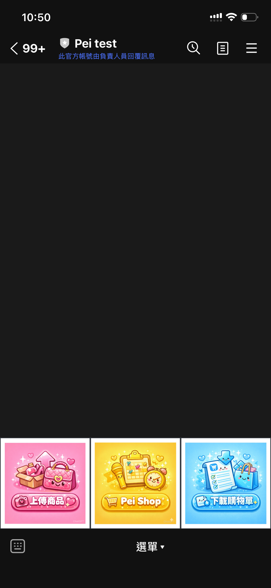
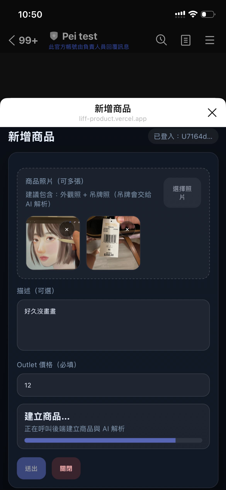
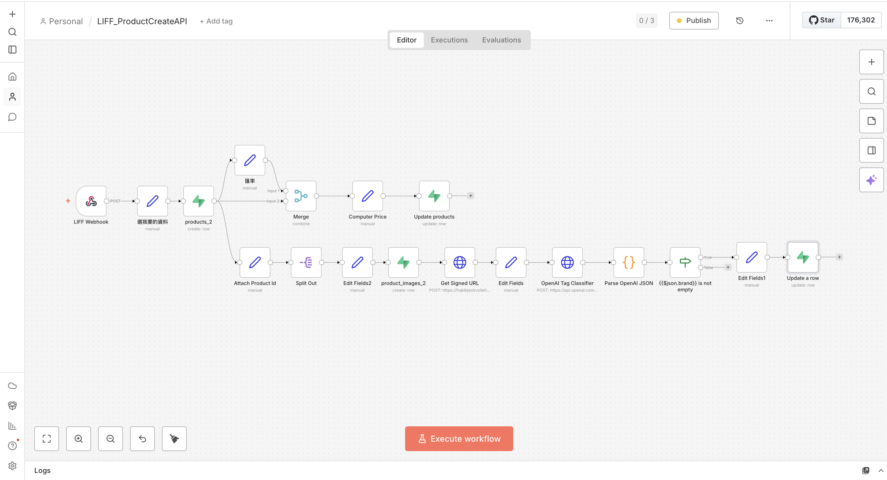

# AI-Driven Product Ingestion Pipeline

<div align="center">

## LINE x AI 全自動代購革命

**📸 拍照 → 🤖 AI 辨識 → 🛒 購物車 → 📄 PDF 訂單**

### 商品上架模組：拍照即建檔，AI 秒速辨識

</div>

[](https://github.com/Backy-JP/AI-Driven_Product_Ingestion_Pipeline_with_LINE_LIFF_and_n8n)
[](LICENSE)
[](https://supabase.com)
[](https://n8n.io)
[](https://line.me)

> **完整解決方案 - 三大專案打造極致代購體驗**  
> 本專案是 **LINE x AI 自動化代購生態系統** 的商品上架模組，需配合以下專案完整運作：
> 
> 1. **[AI-Driven Product Ingestion Pipeline](https://github.com/Backy-JP/AI-Driven_Product_Ingestion_Pipeline_with_LINE_LIFF_and_n8n)** - 本專案：拍照上傳 + AI 商品辨識與資料自動化建檔
> 2. **[LINE LIFF Ecommerce Cart](https://github.com/Backy-JP/LINE_LIFF_Ecommerce_Cart)** - LINE 購物車與訂單系統
> 3. **[LINE PDF Generator](https://github.com/Backy-JP/LINE_PDF_Generator)** - 一鍵生成購物清單 PDF
> 
> **從商品拍攝到訂單下載，全程 LINE 完成，無需跳轉外部平台！**

> **專為代購者設計的高效 AI 商品管理系統**  
> 基於 **LINE LIFF** + **n8n** + **Supabase**  
> **拍照即上傳，AI 自動辨識吊牌，秒級建檔推送商品卡片**

---

## 專案簡介

### 為代購者量身打造的極速建檔系統

> **拍照 → AI 辨識 → 推送商品卡片**  
> **只需當下拍攝商品照片與吊牌，系統自動完成所有建檔工作**

**本系統讓建檔在 30 秒內完成：**
1. ✅ 在商場現場打開 LINE LIFF
2. ✅ 拍攝商品照片 + 吊牌照片
3. ✅ 輸入代購價格，按下送出
4. ✅ AI 自動辨識吊牌資訊（品牌、原價、型號）
5. ✅ 自動建檔並推送商品卡片（規劃中）

### 核心特色

- **極速建檔**：現場拍照上傳，無需後續整理
- **AI 智能辨識**：自動提取吊牌上的品牌、型號、原價
- **友善介面**：LINE 內建整合，操作直覺無學習成本
- **匯率整合**：自動換算貨幣與台幣報價（規劃中）
- **完整記錄**：所有商品自動建檔，方便庫存管理

---

## 系統展示

### 操作介面展示

<table>
<tr>
<td width="50%">

#### LINE 聊天室入口

點擊圖文選單中的"上傳商品"即可開啟 LIFF 介面



</td>
<td width="50%">

#### LIFF 上傳介面（範例）

直接在 LINE 內開啟，支援多圖上傳



</td>
</tr>
</table>

---

### n8n 自動化工作流程

從接收 webhook、AI 辨識、資料庫寫入到 LINE 推送，全自動處理。



*完整的自動化流程：Webhook → AI 辨識 → 匯率轉換 → 資料庫 → LINE 推送*

---

## 技術架構

```
LINE LIFF (前端)
    ↓
Supabase Edge Functions (後端 API)
    ↓
n8n (自動化流程引擎)
    ├─ AI Vision API (吊牌辨識)
    ├─ Exchange Rate API (匯率轉換，規劃中)
    └─ LINE Messaging API (推送，規劃中)
    ↓
Supabase (Database + Storage)
```

### 技術選型

| 技術 | 用途 | 特點 |
|------|------|------|
| **LINE LIFF** | 前端介面 | 整合 LINE，操作友善 |
| **n8n** | 自動化引擎 | 可視化流程編排 |
| **Supabase** | 後端服務 | PostgreSQL + Storage + Edge Functions |
| **AI Vision API** | 吊牌辨識 | 自動提取結構化資訊 |

### 資料庫結構

```sql
products_2 (商品主表)
├── id, line_user_id, batch_id
├── brand, product_name, description
├── price, original_price
└── status, created_at

product_images_2 (商品圖片表)
├── id, product_id
├── image_path, sort_order
└── is_cover, created_at
```

---

## 安裝與部署

### 前置需求

- Node.js 18+
- Supabase 專案（[supabase.com](https://supabase.com)）
- n8n 實例（[n8n.cloud](https://n8n.cloud) 或自架）
- LINE Developers 帳號（[developers.line.biz](https://developers.line.biz)）

### 快速開始

```bash
# 1. Clone repository
git clone https://github.com/Backy-JP/AI-Driven_Product_Ingestion_Pipeline_with_LINE_LIFF_and_n8n.git
cd AI-Driven_Product_Ingestion_Pipeline_with_LINE_LIFF_and_n8n

# 2. 設定環境變數（參考 ENV_SETUP.md）
# 3. 依照以下步驟部署各元件
```

---

### 步驟 1：LINE LIFF 設定

1. 前往 [LINE Developers Console](https://developers.line.biz/console/)
2. 建立 Messaging API Channel
3. 新增 LIFF App：
   - **Endpoint URL**：你的 LIFF 前端網址
   - **Scope**：`profile`、`openid`
   - **Size**：Full
4. 記下 **LIFF ID**
5. 設定圖文選單連結至 LIFF URL

---

### 步驟 2：Supabase 設定

#### 建立專案與資料表

```sql
-- 商品主表
CREATE TABLE products_2 (
  id UUID PRIMARY KEY DEFAULT gen_random_uuid(),
  line_user_id TEXT NOT NULL,
  batch_id TEXT,
  brand TEXT,
  product_name TEXT,
  description TEXT,
  price NUMERIC(10, 2),
  original_price NUMERIC(10, 2),
  status TEXT DEFAULT 'available',
  created_at TIMESTAMPTZ DEFAULT NOW()
);

-- 商品圖片表
CREATE TABLE product_images_2 (
  id UUID PRIMARY KEY DEFAULT gen_random_uuid(),
  product_id UUID REFERENCES products_2(id) ON DELETE CASCADE,
  image_path TEXT NOT NULL,
  sort_order INTEGER DEFAULT 0,
  is_cover BOOLEAN DEFAULT FALSE,
  created_at TIMESTAMPTZ DEFAULT NOW()
);

-- 建立索引
CREATE INDEX idx_products_line_user ON products_2(line_user_id);
CREATE INDEX idx_images_product ON product_images_2(product_id);
```

#### 建立 Storage Bucket

1. Storage → 建立 bucket：`Product_images`
2. 設定為 **Private**

#### 部署 Edge Functions

```bash
# 安裝並連結 Supabase CLI
npm install -g supabase
supabase login
supabase link --project-ref your-project-ref

# 設定環境變數（詳見 ENV_SETUP.md）
supabase secrets set N8N_WEBHOOK_URL=https://your-n8n.com/webhook/xxxxx
supabase secrets set SUPABASE_URL=https://your-project.supabase.co
supabase secrets set SUPABASE_SERVICE_ROLE_KEY=your-service-role-key

# 部署 functions
supabase functions deploy get-signed-url
supabase functions deploy create-product
```

---

## 環境變數設定

本專案需要設定多個 API Keys 與環境變數。

**完整設定說明請參考：[ENV_SETUP.md](ENV_SETUP.md)**

主要需要設定：
- Supabase URL 與 Keys
- n8n Webhook URL
- OpenAI API Key
- LINE LIFF ID 與 Channel Access Token

⚠️ **請勿將 API Keys 提交到 Git！**

---

### 步驟 3：n8n 工作流程設定

#### 匯入工作流程

1. 開啟 n8n Web UI（`http://localhost:5678`）
2. 點選 **Import from File**
3. 選擇 `n8n_LIFF_ProductCreateAPI.json`
4. 設定節點：
   - **Webhook**：記下 webhook URL
   - **AI Vision**：設定 AI API endpoint 與 key
   - **Supabase**：填入 URL 與 Service Role Key
5. 啟動工作流程

#### 更新 Webhook URL

```bash
supabase secrets set N8N_WEBHOOK_URL=https://your-n8n.com/webhook/xxxxx
```

---

### 步驟 4：部署 LIFF 前端

編輯 `liff-product/index.html`：

```javascript
const SUPABASE_URL = "https://your-project.supabase.co";
const SUPABASE_ANON_KEY = "your-anon-key";
await liff.init({ liffId: "your-liff-id" });
```

部署到靜態主機（Vercel / Netlify / GitHub Pages）

---

## 使用說明

### 代購者操作流程（30 秒完成）

1. **開啟 LIFF**：在 LINE 中點擊「上傳商品」圖文選單
2. **上傳照片**：拍攝商品照與吊牌照，批量上傳
3. **填寫資訊**：輸入商品描述（選填）與代購價格（必填）
4. **送出建檔**：點選送出，系統自動處理
5. **AI 辨識**：自動辨識品牌、原價、型號並建檔
6. **接收卡片**（規劃中）：商品卡片推送至聊天室

> **效率提升**：傳統需要 30 分鐘整理，現在 30 秒完成！

---

## 常見問題

<details>
<summary><strong>Q1: LIFF 顯示「未登入」？</strong></summary>

**解決方式**：
- 確認從 LINE 內開啟（非外部瀏覽器）
- 檢查 `liffId` 是否正確
- 確認 LIFF Endpoint URL 設定正確
</details>

<details>
<summary><strong>Q2: 圖片上傳失敗？</strong></summary>

**解決方式**：
```bash
# 檢查 function 與 secrets
supabase functions list
supabase secrets list

# 重新部署
supabase functions deploy get-signed-url
```
</details>

<details>
<summary><strong>Q3: n8n 沒有收到資料？</strong></summary>

**檢查**：
- 確認 `N8N_WEBHOOK_URL` 設定正確
- 確認 n8n workflow 已啟動（Active）
- 檢查 n8n Executions 日誌
</details>

<details>
<summary><strong>Q4: AI 辨識不準確？</strong></summary>

**優化建議**：
- 確保吊牌清晰、無反光、填滿畫面
- 在 n8n AI 節點調整 prompt
- 上傳多張不同角度的吊牌照片
</details>

---

## 開發指南

### 本地開發

```bash
# 啟動 Supabase 本地環境
supabase start
supabase functions serve get-signed-url --env-file .env

# 啟動 LIFF 前端
cd liff-product
python3 -m http.server 8000

# 手機測試使用 ngrok
ngrok http 8000
```

### 除錯技巧

- **Edge Function 日誌**：Supabase Dashboard → Edge Functions → Logs
- **n8n 執行紀錄**：n8n Web UI → Executions
- **LIFF 除錯**：瀏覽器 Console 查看 `liff.isLoggedIn()`

---

## 未來規劃

### 核心功能

- **匯率 API 整合**：串接即時匯率，自動換算台幣
- **Flex Message 推送**：自動推送精美商品卡片至聊天室
- **輪播圖片**：商品卡片支援多圖左右滑動
- **訂單管理**：買家下單、狀態追蹤、自動通知

### 進階功能

- [ ] 商品編輯與搜尋篩選
- [ ] 多幣別支援（JPY、USD、EUR）
- [ ] 庫存管理儀表板
- [ ] 批量操作與報表匯出
- [ ] 多語言支援
- [ ] 支援更多 AI 模型（Claude、Gemini）

---

## 授權條款

本專案採用 MIT License 授權 - 詳見 [LICENSE](LICENSE) 文件

---

## 作者

**Pei (Backy-JP)**

- **Email**: jiapei311157@gmail.com
- **GitHub**: [@Backy-JP](https://github.com/Backy-JP)

---

**Built with ❤️ using LINE LIFF + n8n + Supabase**  
**Designed for 代購者 | Built for Efficiency | Powered by AI**

